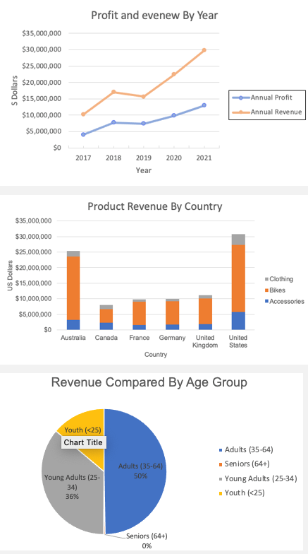

# Summary

This is my summary.

---

## Week 1 – Excel

| | Description |
|-|-|
|   | Add your accompanying text for the image here. You can describe what the image shows or expand on the Week 1 content. |
| 

## Week 2 – Power BI and Tableau

| | Description |
|-|-|
|  | Add your accompanying text for the image here. You can describe what the image shows or expand on the Week 2 content. |
|  | Add your accompanying text for the image here. You can describe what the image shows or expand on the Week 2 content. |

## Week 3 – SQL

| | Description |
|-|-|
|  | Add your accompanying text for the image here. You can describe what the image shows or expand on the Week 3 content. |

## Week 5 – Azure

| | Description |
|-|-|
|  | Add your accompanying text for the image here. You can describe what the image shows or expand on the Week 3 content. |

